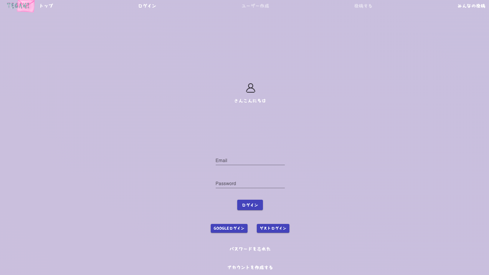
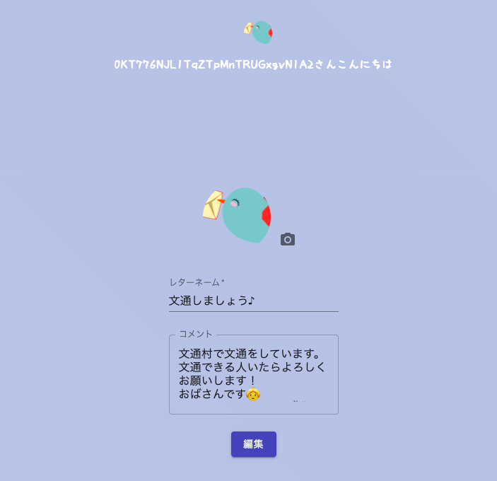
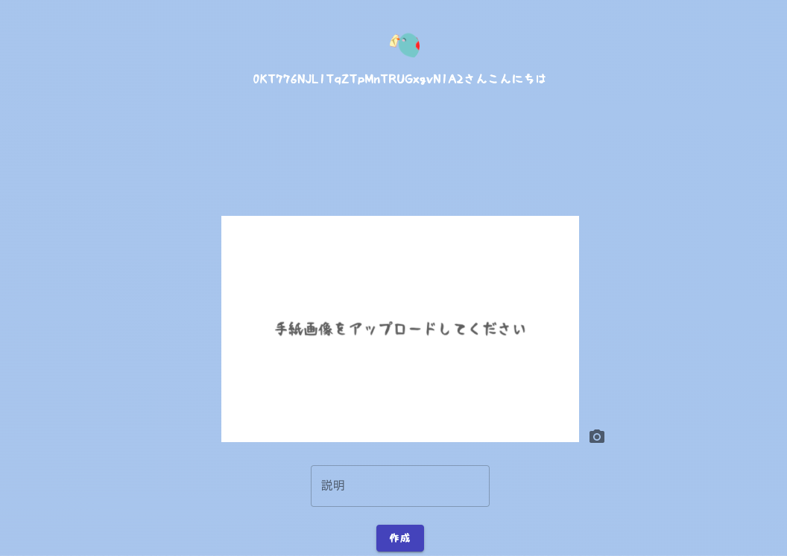
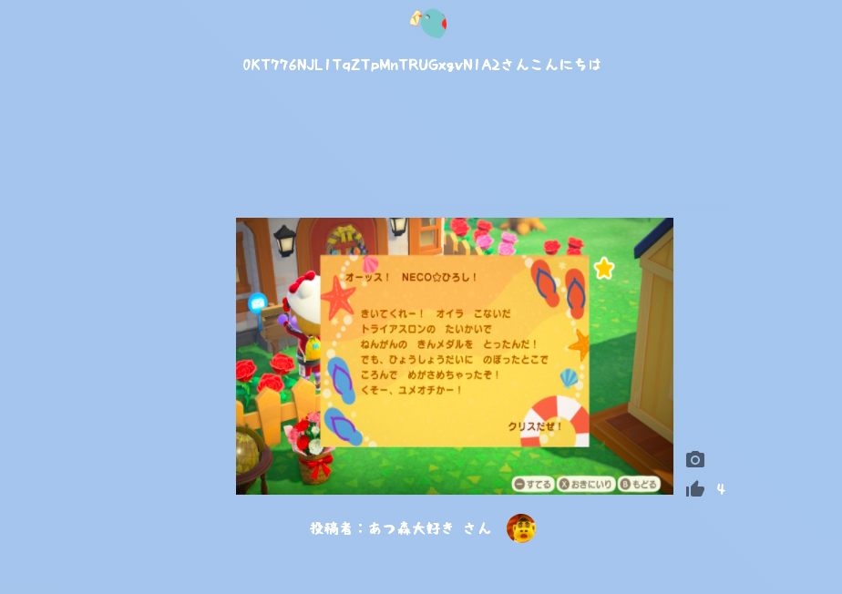
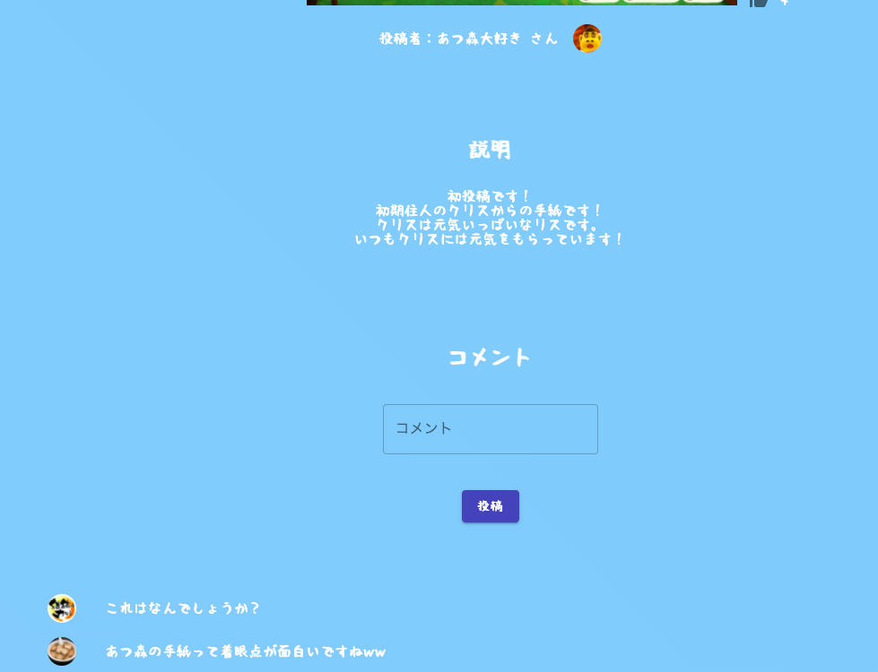
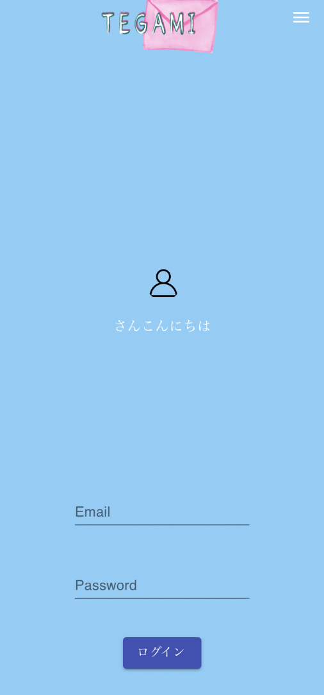
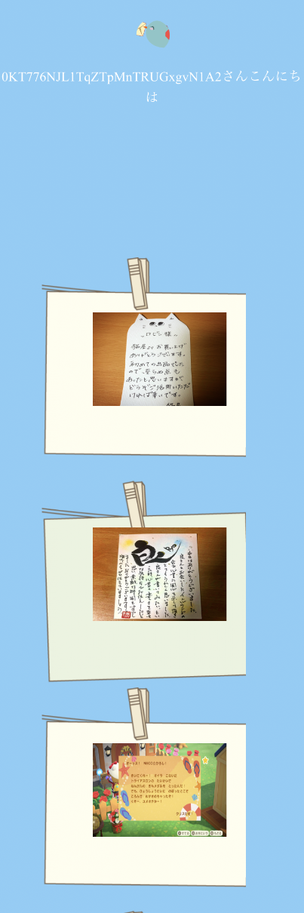
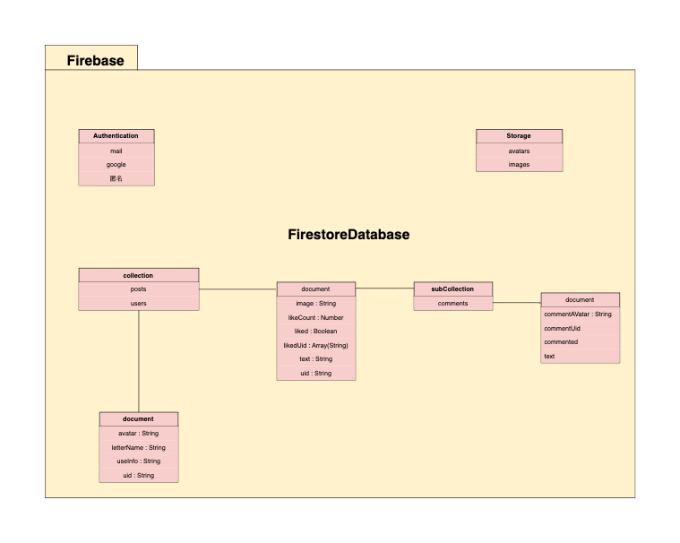

# TEGAMI


## overview

TEGAMI は手紙を共有できるアプリです。

コロナ禍の中で、人と会う機会が減ったので、

人との繋がりを思い出させてくれるアプリを作成してみました。

### PC 版

|                認証                |             ユーザー登録             |
| :--------------------------------: | :----------------------------------: |
|  |  |

|              投稿               |             みんなの投稿              |
| :-----------------------------: | :-----------------------------------: |
|  |  |

|               いいね               |              コメント              |
| :--------------------------------: | :--------------------------------: |
|  |  |

### スマホ版

|                   認証                   |                みんなの投稿                 |
| :--------------------------------------: | :-----------------------------------------: |
|  |  |

## Demo

https://tegami-app.vercel.app/

## Installation/Usage

```
$ git clone https://github.com/ryo0705s/tegami_app.git
```

```
$ npm run dev
```

## Features

- 認証機能（mail、Google、ゲスト）
- 投稿機能
- コメント機能
- いいね機能
- crud 機能

## 実装予定機能

- 最近の投稿表示
- タイムスタンプ
- メッセージ機能
- オンライン文通機能

## Technology

- JavaScript Framework: React, Typescript, Next.js
- styling: Sass, Material-UI
- BaaS: Firebase
  - IDaaS: Firebase Authentication
  - Database: Cloud Firestore
  - Hosting: Firebase Hosting
  - FaaS: Cloud Functions
  - Storage: Cloud Storage

## Requirements

- Node.js

## Auther

### Ryo Sasaki

- [GitHub](https://github.com/ryo0705s)
- [twitter](https://twitter.com/DwmGlory)

### ディレクトリ構成

```
@
├─ firebase
├─ next
├─ build
├─ components // view
│   ├─ pageView // 各ページのview
│   ├─ scss
│   ├─ global.css
│   └─ layout.tsx
├─ context // 各ページで使用するstateを格納
├─ hooks  // カスタムフック
├─ node_modules
├─ pages　// 各ページ
│   ├─ auth // ログイン周り
│   ├─ posts // 投稿周り
│   │   ├─ [postsId]　// 投稿詳細
│   │   ├─ posting.tsx
│   │   └─ postLIsts.tsx
│   ├─ users　// ユーザーページ周り
│   ├─ _app.js
│   └─ index.tsx
├─ public
├─ .env
├─ .firebaserc
├─ .gitignore
├─ .firebase.json
├─ .firebase.ts
├─ .firestore.indexes.json
├─ .firestore.rules
├─ next-env.d.ts
├─ package-lock.json
├─ package.json
├─ README.md
├─ tsconfig.json
└─ yarn.lock
```

### Firebase

